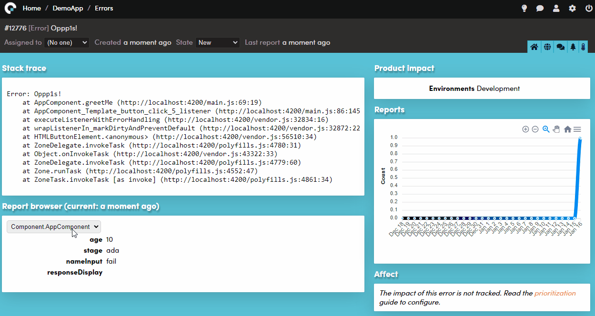

# JavaScript library for Coderr

This library is currently available as a release candidate. Feel free to try it, and please give us feedback.



https://coderr.io


This library supports NodeJS and the browser (es6 module). There are also integration libraries that pick up errors automatically from Express, Angular etc.

## Installation

Download this package:

```js
npm -I coderr.client
```

Add it to your application:

```js
import * as coderr from "coderr.client";

coderr.configure("https://reporting.coderr.io", "yourAppKey");
```

DOM errors will now automatically be reported (for browser-based applications).

To report errors:

```js
import * as coderr from "coderr.client";

try {
    // Do something
    // or to just test:
    throw new Error("Something failed!");
}
catch (e) {
    // You can attach any kind of data.
    coderr.report(e, {userId: 11, address: { City: "Falun" }});
}
```

## Configuration

Coderr detects the environment (production/development) automatically when running in node,
for all other types of applications, specify it:

```js
import * as coderr from "coderr.client";

coderr.configuration.environment = 'production';
```

### Application version

To see which application version an error exist, specify it:

```js
import * as coderr from "coderr.client";

coderr.configuration.applicationVersion = '1.1.3';
```


# Example, integration library

You can, for instance, install the Express package:

```js
npm -I coderr.client.expressjs
```

And then activate it:

```js
import { credentials } from "coderr.client";
import { HttpError, errorMiddleware } from "coderr.client.expressjs";


credentials("https://coderr.io", "yourAppKey", "yourSharedSecret");
```

Finally, activate the error middleware as the last middleware:

```
app.use(errorMiddleware);
```
